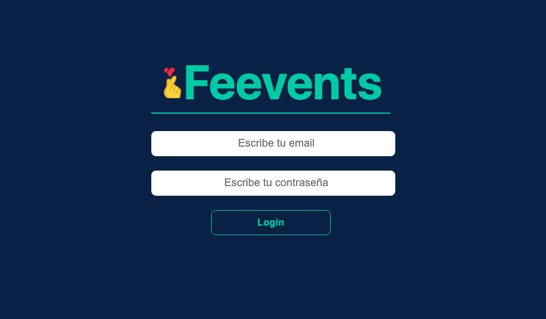
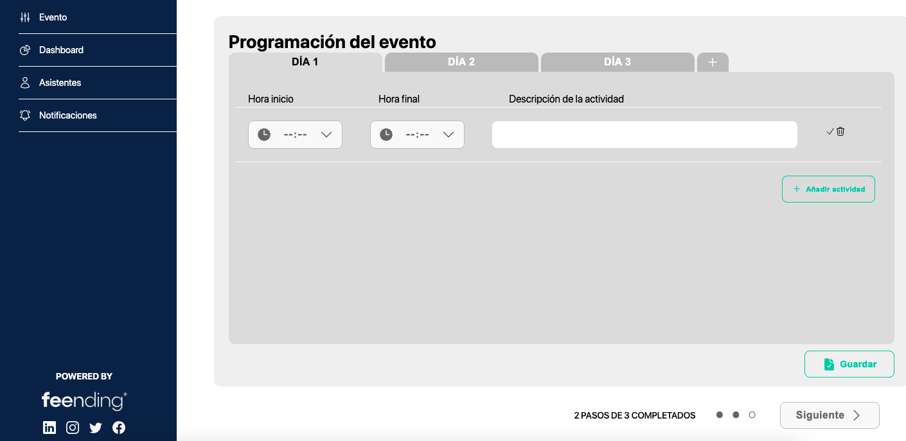
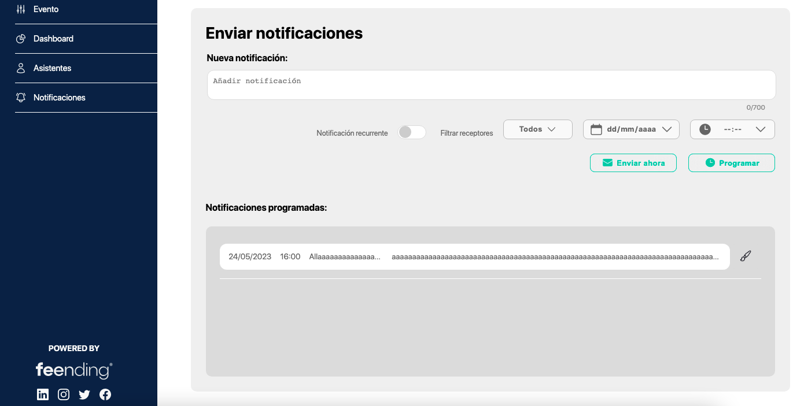
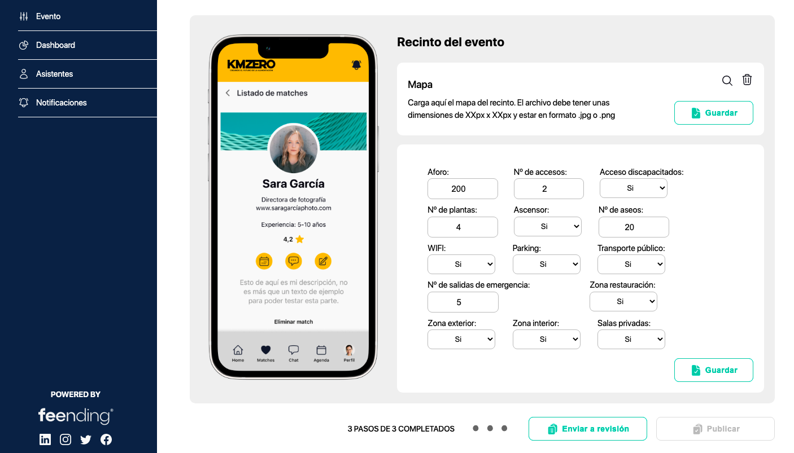
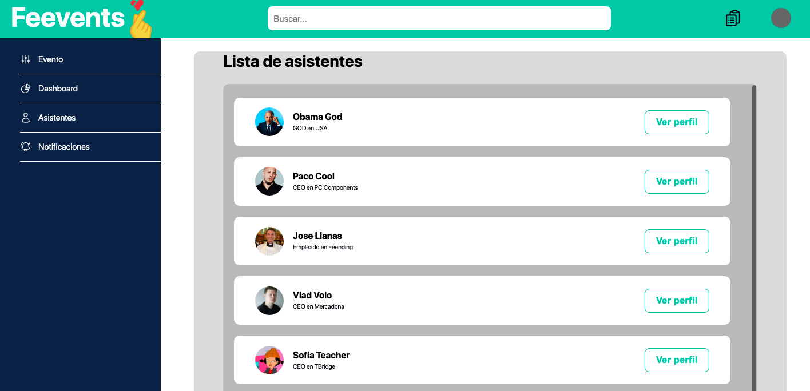

# Admin Panel 🕹
Challenge in four days to develop a full stack project on an event management panel.

* The user logs in to the feevents app with an "administrator" user.
* Configure the event agenda: timetable of the different talks to be held
* List of attendees:
* Notification system:
* Be able to send texts to users within the application: example, in 5 minutes the session of "The Bridge" starts.
* Both send instantly and schedule at a specific time.
* Being able to schedule multiple notifications.

---

### Sponsors 🏷

---

* Being able to upload sponsor logo
* Small description
* Link to the web+

_Only if you have time to spare. This is not a priority for us._

* The Dashboard is out of scope because you have no user interaction data.
* Focus on Desktop version
* On Monday we will send you more detailed info about UX/UI design.

[Backup Figma Feevents](https://www.figma.com/file/MoyTNgMrLCsYRmB0HK9CHU/backup-feevents?type=design&node-id=7-4039&t=MypNiiWS8KtSNALP-0)

---

## Result views 🌄

